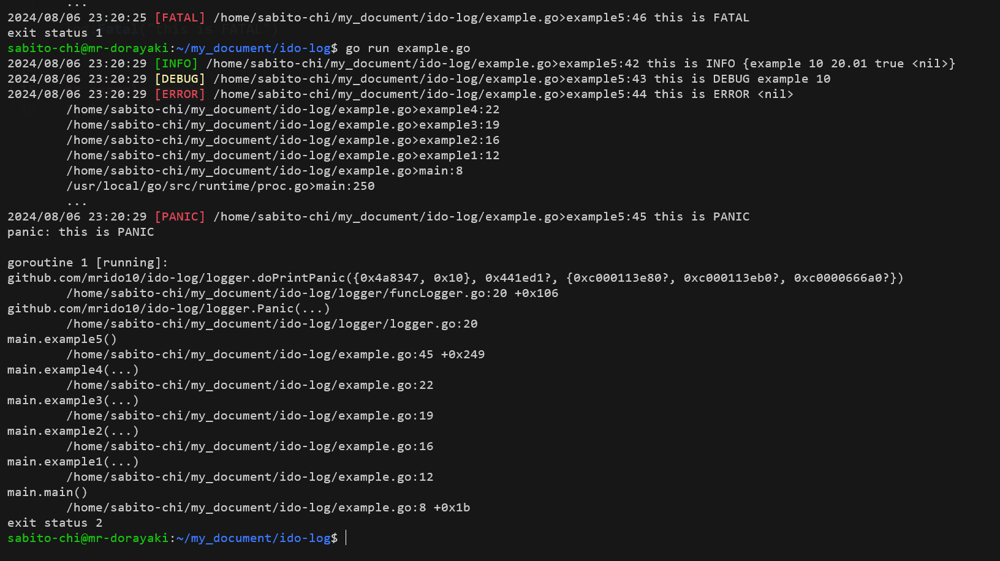

# Logger
Logging with this package can use the following functions
```go
log.Info("this is INFO")

log.Debug("this is DEBUG")

log.Error("this is ERROR")

log.Panic("this is PANIC")

log.Fatal("this is FATAL")
```

## example result
